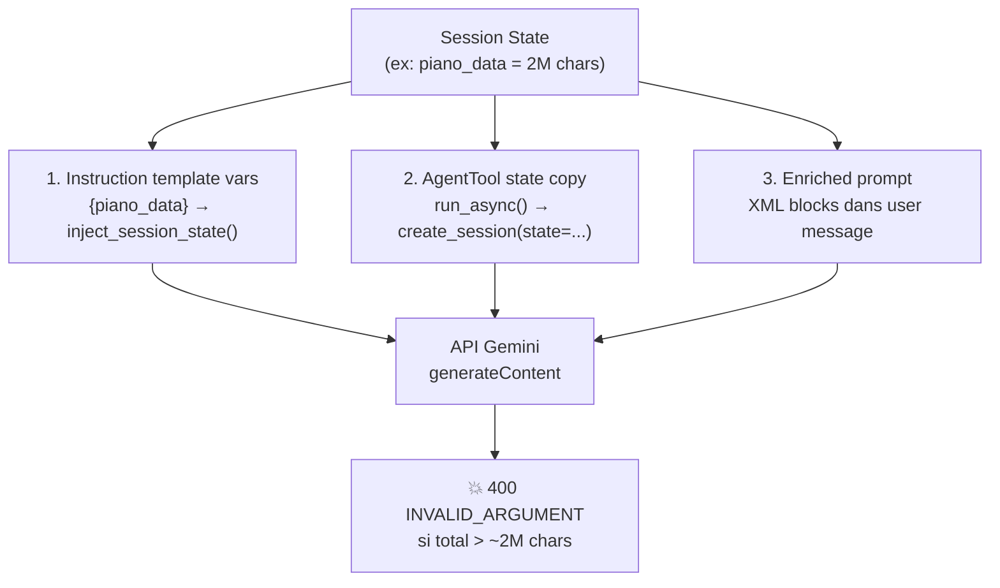

# ADK → Agent Creation Skill (Comprehensive)

Guide complet pour **créer, configurer et déployer** un agent avec Google ADK (Agent Development Kit).
Basé sur la **documentation officielle** (https://google.github.io/adk-docs/) et les **patterns validés en production** du projet `capture-ia`.

---

## 1. Philosophie & Contraintes Critiques du Projet

Avant de coder, intégrez ces règles absolues :

1.  **BigQuery First (Data Strategy)**
    *   ❌ INTERDIT : Fetch 5000 rows en Python pour faire un `sum()`.
    *   ✅ OBLIGATOIRE : Faire l'agrégation en SQL (`SUM`, `COUNT`) via BigQueryToolset.
    *   *Raison* : Évite le "Lost in the Middle" et les hallucinations de calcul.

2.  **Sandbox Environment (Code Agent)**
    *   ❌ INTERDIT : `requests.get()`, `pip install`, `bq_client.query()`.
    *   ✅ OBLIGATOIRE : Le Code Agent est un "calculateur/visualisateur" pur, isolé d'Internet.
    *   *Raison* : Sécurité et contrainte technique du runtime Vertex AI.

3.  **Gemini 3.x Preview**
    *   ❌ INTERDIT : Utiliser la config par défaut (pointe vers `us-central1`).
    *   ✅ OBLIGATOIRE : Forcer `location="global"` via un Wrapper Python.
    *   *Note* : Ce point sera résolu quand les modèles seront GA et régionalisés.

---

## 2. Catégories d'Agents ADK (Officiel)

ADK fournit 3 catégories d'agents :

### 2.1. LLM Agent (`LlmAgent` / `Agent`)
Utilise un LLM comme moteur de raisonnement. Idéal pour les tâches flexibles basées sur le langage naturel.

```python
from google.adk.agents import LlmAgent

agent = LlmAgent(
    model="gemini-2.5-flash",
    name="my_agent",
    description="Does X for users.",  # Crucial pour le routage multi-agent
    instruction="Tu es un expert en...",
    tools=[my_tool_function],
)
```

**Paramètres essentiels :**

| Paramètre | Requis | Description |
|---|---|---|
| `name` | ✅ | Identifiant unique (ex: `billing_agent`). Éviter `user` (réservé). |
| `model` | ✅ | Modèle LLM (string ex: `"gemini-2.5-flash"` ou instance `Gemini()`). |
| `description` | ⚠️ | Crucial en multi-agent pour le routage par le LLM parent. |
| `instruction` | ⚠️ | System prompt. Peut être `str` ou `Callable` (dynamique). |
| `global_instruction` | — | Instruction partagée entre tous les agents (contexte global). |
| `tools` | — | Liste d'outils (fonctions, `BaseTool`, `AgentTool`, `McpToolset`...). |
| `sub_agents` | — | Liste de sous-agents pour hiérarchie / workflow. |
| `generate_content_config` | — | Config LLM (temperature, max_output_tokens, safety_settings). |
| `input_schema` / `output_schema` | — | Pydantic BaseModel pour structurer I/O en JSON. |
| `output_key` | — | Sauvegarde auto de la réponse dans `session.state[key]`. |
| `planner` | — | `BuiltInPlanner` ou `PlanReActPlanner` pour le raisonnement multi-étapes. |
| `code_executor` | — | `VertexAiCodeExecutor` ou `UnsafeLocalCodeExecutor`. |
| `include_contents` | — | `"default"` ou `"none"` pour gérer l'historique dans le contexte. |

### 2.2. Workflow Agents (Déterministes, sans LLM pour le flux)
Contrôlent l'exécution de sous-agents dans des patterns prédéfinis :

```python
from google.adk.agents import SequentialAgent, ParallelAgent, LoopAgent

# Séquentiel : A → B → C
pipeline = SequentialAgent(
    name="data_pipeline",
    sub_agents=[fetcher_agent, processor_agent, reporter_agent]
)

# Parallèle : A + B + C simultanément
parallel = ParallelAgent(
    name="multi_analysis",
    sub_agents=[sentiment_agent, entity_agent, summary_agent]
)

# Boucle : Répète jusqu'à condition d'arrêt
loop = LoopAgent(
    name="refinement_loop",
    sub_agents=[draft_agent, review_agent],
    max_iterations=3  # Sécurité anti-boucle infinie
)
```

**Quand utiliser quel type ?**
- `SequentialAgent` : Pipelines ordonnés, ETL, chaînes de validation.
- `ParallelAgent` : Analyses indépendantes, enrichissement multi-source.
- `LoopAgent` : Raffinement itératif, retry avec amélioration.

### 2.3. Custom Agents (Extension de `BaseAgent`)
Pour des logiques spécifiques non couvertes par les types standard.

```python
from google.adk.agents import BaseAgent

class MyCustomAgent(BaseAgent):
    async def _run_async_impl(self, ctx):
        # Logique custom
        yield Event(...)
```

---

## 3. Structure du Projet

Structure standard ADK pour un agent déployable :

```text
my_agent/
├── __init__.py              # from . import agent
├── agent.py                 # Point d'entrée (contient root_agent)
├── instructions/
│   └── root_agent.md        # System prompt externe
├── sub_agents/              # Sous-agents (optionnel)
│   ├── __init__.py
│   ├── code/
│   │   └── agent.py
│   └── bigquery/
│       └── tools.py
├── tools/                   # Outils custom (optionnel)
│   └── my_tool.py
├── .env                     # Variables d'environnement
├── requirements.txt         # Dépendances Python
└── .agent_engine_config.json # Config déploiement (optionnel)
```

**Règles critiques :**
- `agent.py` DOIT exporter `root_agent` au niveau module.
- `__init__.py` DOIT contenir `from . import agent`.
- Les imports relatifs (`.sub_agents.code.agent`) sont standards.

---

## 4. Implémentation du `agent.py`

### 4.1. Le Wrapper Gemini Global (Projet-spécifique)

Ce wrapper résout le routage vers `global` pour Gemini 3.x Preview et les retries :

```python
import os
from functools import cached_property
from google.adk.models.google_llm import Gemini
from google.genai import types, Client

PROJECT_ID = os.getenv("GOOGLE_CLOUD_PROJECT", "ia-initiatives")

class GeminiGlobal(Gemini):
    """Force l'endpoint global pour Gemini 3.x Preview."""
    
    @cached_property
    def api_client(self) -> Client:
        return Client(
            vertexai=True,
            project=PROJECT_ID,
            location="global",
            http_options=types.HttpOptions(
                retry_options=self.retry_options
            )
        )
```

### 4.2. Factory Pattern pour l'Agent Root

```python
from google.adk.agents import LlmAgent
from google.adk.planners.built_in_planner import BuiltInPlanner
from google.genai import types

def load_instructions() -> str:
    """Charge les instructions depuis un fichier externe."""
    path = Path(__file__).parent / "instructions" / "root_agent.md"
    return path.read_text(encoding="utf-8") if path.exists() else ""

def get_root_agent() -> LlmAgent:
    tools = [
        # bq_toolset,        # BigQueryToolset
        # ga_mcp_toolset,    # McpToolset (GA4)
        # my_function_tool,  # Fonction Python native
    ]
    
    return LlmAgent(
        model=GeminiGlobal(model="gemini-3-flash-preview"),
        name="my_agent",
        description="Description pour le routage multi-agent.",
        instruction=load_instructions(),
        global_instruction=f"Date du jour : {date.today()}",
        tools=tools,
        planner=BuiltInPlanner(
            thinking_config=types.ThinkingConfig(
                include_thoughts=False,  # FALSE en prod (évite crash streaming)
                thinking_level="medium"  # "low", "medium", "high"
            )
        ),
        generate_content_config=types.GenerateContentConfig(
            temperature=1.0,
            max_output_tokens=16384,
            automatic_function_calling=types.AutomaticFunctionCallingConfig(
                disable=True  # Contrôle manuel des appels d'outils
            ),
        ),
    )

# L'instance 'root_agent' est REQUISE par ADK
root_agent = get_root_agent()
```

---

## 5. Outils (Tools)

Les outils donnent à l'agent des capacités au-delà du LLM.

### 5.1. FunctionTool (Fonction Python native)

ADK wraps automatiquement les fonctions Python en `FunctionTool`.
Le **docstring** et les **type hints** sont essentiels : le LLM les utilise pour décider quand appeler l'outil.

```python
def get_weather(city: str, unit: str = "celsius") -> str:
    """Récupère la météo actuelle pour une ville donnée.
    
    Args:
        city: Nom de la ville (ex: "Paris").
        unit: Unité de température ("celsius" ou "fahrenheit").
    
    Returns:
        Texte décrivant la météo actuelle.
    """
    # Implémentation
    return f"Il fait 22°{unit[0].upper()} à {city}"

agent = LlmAgent(tools=[get_weather])  # Auto-wrapped
```

**Règles pour les FunctionTools :**
- Docstring obligatoire et descriptif.
- Type hints sur tous les paramètres.
- Noms de fonctions explicites (pas de `do_thing`).
- Le `ToolContext` peut être ajouté comme dernier paramètre pour accéder au state.

```python
from google.adk.tools.tool_context import ToolContext

def save_preference(key: str, value: str, tool_context: ToolContext) -> str:
    """Sauvegarde une préférence utilisateur."""
    tool_context.state[f"user:{key}"] = value
    return f"Préférence '{key}' sauvegardée."
```

### 5.2. BigQueryToolset (Built-in)

```python
import google.auth
from google.adk.tools.bigquery.bigquery_toolset import BigQueryToolset, BigQueryToolConfig
from google.adk.tools.bigquery.bigquery_credentials import BigQueryCredentialsConfig

# ⚠️ OBLIGATOIRE pour Agent Engine : passer les credentials ADC explicitement
# Sans ça, BigQueryToolset(credentials_config=None) → bigquery.Client(credentials=None)
# → fallback ADC vers le Compute SA par défaut (PAS le SA configuré)
_credentials, _project = google.auth.default(
    scopes=["https://www.googleapis.com/auth/bigquery"],
)

bq_toolset = BigQueryToolset(
    credentials_config=BigQueryCredentialsConfig(
        credentials=_credentials,
    ),
    bigquery_tool_config=BigQueryToolConfig(
        location="EU",              # Région BQ
        write_mode="allowed",       # "blocked" | "allowed"
        max_query_result_rows=5000, # Limite de sécurité
        compute_project_id="ia-initiatives",  # Projet de facturation des jobs
    ),
)
```

> [!CAUTION]
> **En Agent Engine, `credentials_config=None` fait fallback vers le mauvais SA !**
> Voir le skill `agent-engine-deploy` §10.11 pour le diagnostic complet.
> Toujours passer les credentials ADC explicitement quand l'agent doit écrire dans BQ.

### 5.3. McpToolset (Model Context Protocol)

Intègre des serveurs MCP externes. **3 transports disponibles** :

| Transport | Status | Usage |
|---|---|---|
| `StdioConnectionParams` | ⚠️ Fragile en multi-worker | Subprocess — risque de `RuntimeError` en async |
| `SseConnectionParams` | ❌ Deprecated (supprimé juin 2025) | Legacy, ne pas utiliser |
| `StreamableHTTPConnectionParams` | ✅ **Standard actuel** | HTTP in-process ou remote |

#### Pattern recommandé : Manager Singleton + Daemon Thread (in-process)

Pour un serveur MCP embarqué (ex: GA4), lancer un serveur Streamable HTTP en thread daemon :

```python
# sub_agents/ga/mcp_manager.py
import threading, socket, time, os, logging

logger = logging.getLogger(__name__)
_server_started = False
_lock = threading.Lock()

def _get_port() -> int:
    return int(os.environ.get("MCP_PORT", "8765"))

def get_mcp_url() -> str:
    return f"http://127.0.0.1:{_get_port()}/mcp"

def _run_server():
    from my_mcp_package.coordinator import mcp  # Singleton FastMCP
    import my_mcp_package.tools.module1  # noqa: register tools
    import my_mcp_package.tools.module2  # noqa: register tools

    # ⚠️ host/port via settings — FastMCP.run() n'accepte QUE transport
    mcp.settings.host = "127.0.0.1"
    mcp.settings.port = _get_port()
    mcp.run(transport="streamable-http")

def _wait_for_server(timeout=30.0):
    port = _get_port()
    deadline = time.monotonic() + timeout
    while time.monotonic() < deadline:
        try:
            with socket.create_connection(("127.0.0.1", port), timeout=1):
                return
        except (ConnectionRefusedError, OSError):
            time.sleep(0.3)
    raise RuntimeError(f"MCP server failed to start on port {port}")

def ensure_mcp_server():
    global _server_started
    if _server_started:
        return
    with _lock:
        if _server_started:
            return
        thread = threading.Thread(target=_run_server, daemon=True, name="mcp-server")
        thread.start()
        _wait_for_server()
        _server_started = True
```

```python
# sub_agents/ga/tools.py
from google.adk.tools.mcp_tool.mcp_toolset import McpToolset
from google.adk.tools.mcp_tool.mcp_session_manager import StreamableHTTPConnectionParams
from .mcp_manager import ensure_mcp_server, get_mcp_url

ensure_mcp_server()

ga_mcp_toolset = McpToolset(
    connection_params=StreamableHTTPConnectionParams(
        url=get_mcp_url(),
        timeout=60.0,
    )
)
```

> [!CAUTION]
> **Monkey-patching in-process** : Contrairement au mode Stdio (subprocess isolé),
> un patch appliqué en mode in-process affecte **TOUT le process** (BigQuery, AI Platform…).
> Les patches doivent être **scope-aware** — vérifier les scopes demandés avant d'agir.
> 
> ```python
> _ANALYTICS_SCOPES = frozenset({"https://www.googleapis.com/auth/analytics.readonly"})
> 
> def _patched_default(scopes=None, **kwargs):
>     creds, project = _orig_default(scopes, **kwargs)
>     requested = set(scopes or [])
>     if email and hasattr(creds, "with_subject") and requested & _ANALYTICS_SCOPES:
>         creds = creds.with_subject(email)  # Seulement pour Analytics
>     return creds, project
> ```

#### MCP Remote (serveur distant)

Pour un serveur MCP déjà déployé (Cloud Run, etc.) :

```python
ga_mcp_toolset = McpToolset(
    connection_params=StreamableHTTPConnectionParams(
        url="https://my-mcp-server.run.app/mcp",
        timeout=60.0,
    )
)
```

### 5.4. AgentTool (Agent comme outil)

Permet à un agent d'appeler un autre agent comme un outil :

```python
from google.adk.tools.agent_tool import AgentTool

# Utilisation dans une fonction tool
async def delegate_to_code_agent(request: str, tool_context: ToolContext) -> str:
    result = await AgentTool(agent=code_agent).run_async(
        args={"request": request},
        tool_context=tool_context
    )
    return str(result)
```

> [!CAUTION]
> **AgentTool copie TOUT le `state` du parent dans la session enfant.**
> Dans `agent_tool.py:run_async()`, le code fait :
> ```python
> state_dict = {k: v for k, v in tool_context.state.to_dict().items()
>               if not k.startswith('_adk')}
> session = await runner.session_service.create_session(state=state_dict)
> ```
> Si le state contient 2M de données Piano Analytics, ces 2M sont **copiées intégralement**
> dans la session enfant, même si l'enfant n'en a pas besoin dans son instruction.
> Ceci est une source majeure de **400 INVALID_ARGUMENT** (payload overflow).
> → Voir §13bis pour la stratégie de mitigation.


---

## 6. Callbacks (Interception & Contrôle)

Les callbacks permettent d'intercepter et contrôler le flux d'exécution de l'agent.

### 6.1. Types de Callbacks

| Callback | Quand | Reçoit | Return None = | Return Object = |
|---|---|---|---|---|
| `before_agent_callback` | Avant l'agent | `CallbackContext` | Continue normalement | `types.Content` → Skip agent |
| `after_agent_callback` | Après l'agent | `CallbackContext` | Garde le résultat | `types.Content` → Remplace |
| `before_model_callback` | Avant le LLM | `CallbackContext`, `LlmRequest` | Appelle le LLM | `LlmResponse` → Skip LLM |
| `after_model_callback` | Après le LLM | `CallbackContext`, `LlmResponse` | Garde la réponse | `LlmResponse` → Remplace |
| `before_tool_callback` | Avant l'outil | `CallbackContext`, `BaseTool`, `args`, `ToolContext` | Exécute l'outil | `dict` → Skip outil |
| `after_tool_callback` | Après l'outil | `BaseTool`, `args`, `ToolContext`, `tool_response` | Garde le résultat | `dict` → Remplace |

### 6.2. Exemples Pratiques

```python
from google.adk.agents.callback_context import CallbackContext
from google.adk.models.llm_request import LlmRequest
from google.adk.models.llm_response import LlmResponse
from typing import Optional, Dict, Any

# --- Initialisation du session state ---
def init_session(callback_context: CallbackContext):
    """before_agent_callback : Initialise le state au premier appel."""
    if "initialized" not in callback_context.state:
        callback_context.state["initialized"] = True
        callback_context.state["call_count"] = 0

# --- Guardrail d'entrée ---
def input_guardrail(
    callback_context: CallbackContext, 
    llm_request: LlmRequest
) -> Optional[LlmResponse]:
    """before_model_callback : Bloque les requêtes dangereuses."""
    last_msg = llm_request.contents[-1].parts[0].text if llm_request.contents else ""
    if "supprime tout" in last_msg.lower():
        # Skip le LLM, retourne une réponse directe
        return LlmResponse(...)  # Réponse de blocage
    callback_context.state["call_count"] += 1
    return None  # Continue normalement

# --- Auto-save des résultats d'outils ---
def auto_save_results(
    tool: BaseTool, 
    args: Dict[str, Any], 
    tool_context: ToolContext, 
    tool_response: Any
) -> Optional[Dict]:
    """after_tool_callback : Sauvegarde automatique dans le state."""
    if tool.name.startswith("mcp_bigquery_"):
        tool_context.state["last_bq_result"] = str(tool_response)
    return None  # Ne modifie pas la réponse

# --- Validation des arguments d'outil ---
def validate_tool_args(
    callback_context: CallbackContext,
    tool: BaseTool,
    args: Dict[str, Any],
    tool_context: ToolContext
) -> Optional[Dict]:
    """before_tool_callback : Valide les paramètres avant exécution."""
    if tool.name == "delete_record" and not args.get("confirm"):
        return {"error": "Confirmation requise pour la suppression."}
    return None

# --- Registration sur l'agent ---
agent = LlmAgent(
    before_agent_callback=init_session,
    before_model_callback=input_guardrail,
    before_tool_callback=validate_tool_args,
    after_tool_callback=auto_save_results,
    # ...
)
```

---

## 7. Session State & Context

### 7.1. Session State (`session.state`)

Dictionnaire mutable associé à la session courante.

**Organisation par préfixes :**

| Préfixe | Scope | Persistance |
|---|---|---|
| *(aucun)* | Session courante | Durée de la session |
| `user:` | Utilisateur (cross-session) | Persistant si SessionService le supporte |
| `app:` | Application globale | Persistant si SessionService le supporte |
| `temp:` | Invocation uniquement | Supprimé après chaque tour |

```python
# Dans un callback ou un outil avec ToolContext
callback_context.state["user:preference"] = "dark_mode"
callback_context.state["temp:step_result"] = intermediate_value
```

### 7.2. Injection dans les Instructions (⚠️ PIÈGE MAJEUR)

Les clés du state sont injectables dans les instructions via `{key}` :

```python
agent = LlmAgent(
    instruction="Salue l'utilisateur {user:name}. Son panier : {cart_items}."
)
```

⚠️ **Piège classique** : Les accolades JSON dans les instructions DOIVENT être échappées.
- ❌ `Exemple : {"key": "value"}` → Crash `KeyError`
- ✅ `Exemple : {{"key": "value"}}` → OK

> [!CAUTION]
> **PIÈGE CRITIQUE : Template vars + Données volumineuses = 400 INVALID_ARGUMENT**
>
> Le mécanisme d'injection (`instructions_utils.py:inject_session_state()`) résout
> CHAQUE `{var_name}` trouvé dans l'instruction en cherchant dans `session.state`.
>
> Si l'instruction du Code Agent contient `{piano_data}` et que le state contient 2M
> de caractères sous cette clé, ADK injecte les 2M **directement dans le system prompt**.
> Combiné avec AgentTool qui copie le state (§5.4), les données circulent par
> **3 chemins simultanés** :
>
> | Chemin | Mécanisme ADK | Taille |
> |---|---|---|
> | 1. System Instruction | `{var}` → `inject_session_state()` | 2M |
> | 2. State enfant | `AgentTool.run_async()` → copie state | 2M |
> | 3. Enriched prompt | XML blocks dans le user message | 2M |
>
> **Total envoyé à l'API Gemini : ~6M chars → 400 INVALID_ARGUMENT.**
>
> **Solution validée** : Ne JAMAIS utiliser de template vars `{data}` dans
> l'instruction d'un agent qui reçoit des données volumineuses. Passer les données
> uniquement via le prompt enrichi (chemin 3), avec troncation.
> → Voir §13bis pour le pattern complet.

### 7.3. Context Objects

| Type | Usage | Accès |
|---|---|---|
| `InvocationContext` | Interne au framework | `session`, `agent`, `invocation_id`, services |
| `ReadonlyContext` | InstructionProvider | Lecture seule du state |
| `CallbackContext` | Callbacks before/after | State mutable + artifacts |
| `ToolContext` | Fonctions tools | State mutable + auth + memory search |

---

## 8. Multi-Agent Systems

### 8.1. Hiérarchie (Parent / Sub-Agents)

```python
coordinator = LlmAgent(
    name="coordinator",
    model="gemini-2.5-flash",
    sub_agents=[
        greeter_agent,
        task_agent,
        reporter_agent,
    ]
)
```

- Un agent ne peut avoir qu'**un seul parent** (`ValueError` sinon).
- Navigation : `agent.parent_agent`, `agent.find_agent("name")`.

### 8.2. Deux modes de délégation

**LLM-Driven (Auto Delegation)** : Le LLM parent choisit dynamiquement quel sub-agent appeler, basé sur les `name` et `description` des sub-agents.

```python
root = LlmAgent(
    name="router",
    instruction="Route les requêtes vers le bon agent spécialisé.",
    sub_agents=[billing_agent, support_agent, sales_agent]
)
```

**Programmatic (AgentTool)** : Appel explicite via une fonction tool :

```python
# Le Root Agent décide quand appeler le Code Agent via call_code_writer_agent()
tools=[bq_toolset, call_code_writer_agent]
```

### 8.3. Communication Inter-Agents via State

Les agents partagent le même `session.state`. Pattern recommandé :

```python
# Agent 1 (producteur) - via output_key
agent_1 = LlmAgent(output_key="step1_result", ...)

# Agent 2 (consommateur) - via injection
agent_2 = LlmAgent(
    instruction="Utilise le résultat précédent : {step1_result}",
    ...
)

# Orchestration séquentielle
pipeline = SequentialAgent(sub_agents=[agent_1, agent_2])
```

---

## 9. Déploiement

### 9.1. Modes de test local

| Commande | Usage |
|---|---|
| `adk web my_agent/` | UI web de développement avec chat intégré |
| `adk run my_agent/` | Exécution CLI (stdin/stdout) |

### 9.2. Déploiement Production → Agent Engine

Le déploiement d'agents ADK se fait sur **Vertex AI Agent Engine** (runtime managé, auto-scaling).

> **📘 Voir le skill `agent-engine-deploy`** pour la procédure complète :
> CLI, SDK, `.agent_engine_config.json`, IAM, troubleshooting, lifecycle management.

### 9.3. Variables d'Environnement Locales (`.env`)

```bash
GOOGLE_CLOUD_PROJECT=ia-initiatives
GOOGLE_GENAI_USE_VERTEXAI=true
GOOGLE_CLOUD_LOCATION=global           # ou us-central1 pour infra
ADK_ENABLE_PROGRESSIVE_SSE_STREAMING=1 # Fix parallel function calls
```

> ⚠️ En production, ces variables doivent être déclarées dans `.agent_engine_config.json` sous `env_vars` (voir skill `agent-engine-deploy` §3.1).

---

## 10. Sécurité & Guardrails

### 10.1. Stratégie en Couches

1. **Identité** : Service Account avec permissions minimales (IAM).
2. **Guardrails Input** : `before_model_callback` pour filtrer les requêtes.
3. **Guardrails Output** : `after_model_callback` pour assainir les réponses.
4. **Validation Outils** : `before_tool_callback` pour valider les arguments.
5. **Sandbox Code** : `VertexAiCodeExecutor` (pas d'accès réseau).
6. **Network** : VPC Service Controls pour empêcher l'exfiltration.

### 10.2. Safety Settings Gemini

```python
generate_content_config=types.GenerateContentConfig(
    safety_settings=[
        types.SafetySetting(
            category=types.HarmCategory.HARM_CATEGORY_DANGEROUS_CONTENT,
            threshold=types.HarmBlockThreshold.BLOCK_LOW_AND_ABOVE,
        ),
        types.SafetySetting(
            category=types.HarmCategory.HARM_CATEGORY_HARASSMENT,
            threshold=types.HarmBlockThreshold.BLOCK_MEDIUM_AND_ABOVE,
        ),
    ]
)
```

---

## 11. Planner (Raisonnement Multi-Étapes)

### 11.1. BuiltInPlanner (Gemini Thinking)

Exploite la capacité native de "thinking" de Gemini 2.5+ :

```python
from google.adk.planners.built_in_planner import BuiltInPlanner

planner=BuiltInPlanner(
    thinking_config=types.ThinkingConfig(
        include_thoughts=True,   # True pour debug, False en prod
        thinking_budget=1024,    # Tokens dédiés au raisonnement
        thinking_level="high",   # "low" | "medium" | "high"
    )
)
```

⚠️ `include_thoughts=True` peut causer des problèmes de streaming en production.
Utiliser `False` par défaut et `True` uniquement en développement.

### 11.2. PlanReActPlanner (Pour modèles sans thinking natif)

```python
from google.adk.planners import PlanReActPlanner

planner=PlanReActPlanner()  # Force le pattern Plan → Action → Reasoning
```

---

## 12. Code Execution

### 12.1. VertexAiCodeExecutor (Sandbox Sécurisé)

```python
from google.adk.code_executors import VertexAiCodeExecutor

code_executor = VertexAiCodeExecutor(
    project=PROJECT_ID,
    location="us-central1",
    staging_bucket="gs://my-bucket/staging",
    resource_name=f"projects/{PROJECT_ID}/locations/us-central1/extensions/{EXT_ID}",
)

code_agent = LlmAgent(
    model=GeminiGlobal(model="gemini-3-flash-preview"),
    name="python_analyst",
    code_executor=code_executor,
    tools=[],  # Pas de tools, uniquement code execution
)
```

### 12.2. UnsafeLocalCodeExecutor (Dev uniquement)

```python
from google.adk.code_executors import UnsafeLocalCodeExecutor

# ⚠️ JAMAIS EN PRODUCTION - Exécute du code arbitraire !
code_executor = UnsafeLocalCodeExecutor()
```

---

## 13. Stratégie de Données (Data Handover)

Comment passer des données entre agents (Root → Code Agent) :

### Méthode 1 : Contexte XML (< 50 lignes)

```python
# Dans le Root Agent, construire le prompt enrichi
enriched_request = f"""
<data_context>
{json.dumps(data, indent=2)}
</data_context>

{user_request}
"""
```

### Méthode 2 : Session State + Append Mode (Volume moyen)

```python
# after_tool_callback : Accumule les résultats dans le state
if "data_history" not in tool_context.state:
    tool_context.state["data_history"] = []

tool_context.state["data_history"].append({
    "timestamp": str(datetime.now()),
    "tool": tool_name,
    "data": serialized_response
})
```

### Méthode 3 : GCS Handover (Grand volume, visualisation)

1. Root Agent → Exécute SQL → Sauvegarde en JSON/CSV dans GCS.
2. Passe l'URI `gs://...` au Code Agent.
3. Code Agent → `pd.read_csv('gs://...')`.

---

## 13bis. State Payload Management (Prévention des 400 INVALID_ARGUMENT)

> [!IMPORTANT]
> Section issue d'un debugging réel en production. Applicable dès qu'un agent
> accumule des données via callbacks (MCP, BigQuery, GA4, etc.) et les transmet
> à un sous-agent (Code Agent via AgentTool).

### Le Problème : 3 Chemins de Fuite des Données

Quand un agent root collecte des données et les passe à un Code Agent via `AgentTool`,
les données peuvent circuler par **3 chemins non évidents** dans ADK :



### La Solution : Défense en 3 Couches

#### Couche 1 — Instruction du sous-agent : ZÉRO template vars data

```python
# ❌ INTERDIT — injecte les données dans le system prompt
code_agent = LlmAgent(
    instruction="""Utilise ces données :
    BigQuery: {bigquery_data}
    Piano: {piano_data}"""
)

# ✅ CORRECT — instruction sans template vars de données
code_agent = LlmAgent(
    instruction="""Tu es un moteur de calcul Python.
    Les données te seront fournies dans le message utilisateur."""
)
```

> Validé contre le sample officiel Google `data-science` (adk-samples) : l'instruction
> du code agent ne contient **aucun** template variable pour les données.

#### Couche 2 — Callbacks : Cap sur l'accumulation dans le state

Les `after_tool_callback` qui accumulent des résultats MCP doivent **plafonner** le state :

```python
def _save_results(tool, args, tool_context, tool_response):
    # ... sérialisation ...
    
    # Accumulation avec CAP
    MAX_STATE_CHARS = 500_000  # 500K par source
    all_data = [item["data"] for item in tool_context.state["data_history"]]
    concatenated = "[" + ",".join(all_data) + "]"
    
    # Si trop gros, ne garder que les DERNIÈRES entrées qui tiennent
    if len(concatenated) > MAX_STATE_CHARS:
        kept = []
        total = 2  # pour [ et ]
        for item_data in reversed(all_data):
            if total + len(item_data) + 1 > MAX_STATE_CHARS:
                break
            kept.insert(0, item_data)
            total += len(item_data) + 1
        concatenated = "[" + ",".join(kept) + "]"
        logger.warning(f"⚠️ Data capped: {len(all_data)} → {len(kept)} entries")
    
    tool_context.state["my_data"] = concatenated
```

> **Pourquoi garder les derniers ?** Les requêtes les plus récentes sont
> généralement les plus pertinentes pour la visualisation demandée.

#### Couche 3 — Enriched Prompt : Troncation avant envoi

```python
async def call_code_writer_agent(request, tool_context):
    piano_data = tool_context.state.get("piano_data", "")
    
    # Troncation de sécurité
    MAX_DATA_CHARS = 500_000
    if len(piano_data) > MAX_DATA_CHARS:
        logger.warning(f"⚠️ Truncating: {len(piano_data)} → {MAX_DATA_CHARS}")
        piano_data = piano_data[:MAX_DATA_CHARS] + "\n... [TRUNCATED]"
    
    enriched_request = f"""
    # DEMANDE
    {request}
    
    # DONNÉES
    <PIANO_ANALYTICS>
    {piano_data}
    </PIANO_ANALYTICS>
    """
```

### Budget Total Recommandé

| Composant | Budget max | Justification |
|---|---|---|
| System instruction (code agent) | ~5K chars | Instructions pures, pas de data |
| Enriched prompt (données) | 500K / source | Troncation couche 3 |
| State copié (AgentTool) | 500K / source | Cap couche 2 |
| **Total API payload** | **< 1.5M chars** | Sous la limite Gemini (~2M) |

### Diagnostic Rapide

Si erreur `400 INVALID_ARGUMENT` sur `generateContent` :

1. **Vérifier les tailles dans les logs** : `State data sizes: BQ=X, GA=Y, Piano=Z`
2. **Si > 500K par source** → Cap manquant dans le callback (couche 2)
3. **Si total > 1M** → Troncation manquante dans l'enriched prompt (couche 3)
4. **Si instruction contient `{data_var}`** → Template var leak (couche 1)
5. **Vérifier le source code ADK** :
   - `instructions_utils.py:124` → regex `{var}` résolution
   - `agent_tool.py:run_async()` → copie intégrale du state
   - `llm_agent.py:canonical_instruction()` → passe par inject_session_state

---

## 14. Gestion des Instructions (`root_agent.md`)

### 14.1. Structure Recommandée

```markdown
# RÔLE
Tu es un Senior Data Analyst spécialisé en marketing digital.

# CONTRAINTES
- N'invente JAMAIS de données.
- Si tu ne sais pas, dis-le clairement.
- Utilise TOUJOURS les outils SQL pour les calculs, jamais le calcul mental.

# UTILISATION DES OUTILS
- Pour les données : `execute_sql` avec agrégation SQL.
- Pour les visualisations : délègue au Code Agent.
- Pour les exports : utilise le Code Agent (CSV/Excel).

# FORMAT DE SORTIE
- Tableaux en Markdown pour les données tabulaires.
- Bullet points pour les insights.
- Toujours conclure avec une recommandation actionnable.
```

### 14.2. Piège des Accolades

- ❌ `Exemple de JSON : {"key": "value"}` → ADK pense que `{key}` est une variable → `KeyError`
- ✅ `Exemple de JSON : {{"key": "value"}}` → Accolades échappées → OK

### 14.3. Instructions Dynamiques

```python
# Via une Callable
def dynamic_instruction(readonly_context: ReadonlyContext) -> str:
    user_role = readonly_context.state.get("user:role", "viewer")
    return f"L'utilisateur a le rôle : {user_role}. Adapter l'accès."

agent = LlmAgent(instruction=dynamic_instruction)
```

---

## 15. Checklist de Validation

Avant de considérer l'agent comme "prêt" :

### Fondamentaux
- [ ] **`root_agent`** exporté au niveau module dans `agent.py` ?
- [ ] **`__init__.py`** contient `from . import agent` ?
- [ ] **Wrapper Global** en place pour Gemini 3 ?
- [ ] **`.env`** avec `GOOGLE_CLOUD_PROJECT`, `GOOGLE_GENAI_USE_VERTEXAI` ?

### Configuration
- [ ] **Thinking disabled** en prod ? (`include_thoughts=False`)
- [ ] **Accolades échappées** dans les instructions ?
- [ ] **`automatic_function_calling=disable=True`** si contrôle manuel voulu ?
- [ ] **`ADK_ENABLE_PROGRESSIVE_SSE_STREAMING=1`** configuré ?

### Outils & Data
- [ ] **Outils MCP** connectés (pas de bq client en dur) ?
- [ ] **Data Strategy** respectée (agrégation SQL, pas Python) ?
- [ ] **Docstrings & type hints** sur toutes les FunctionTools ?
- [ ] **`max_query_result_rows`** limité dans BigQueryToolset ?

### Payload Overflow Prevention (§13bis)
- [ ] **Zéro template vars data** dans les instructions du Code Agent ?
- [ ] **Callbacks cappés** à 500K chars par source ?
- [ ] **Enriched prompt** avec troncation avant envoi ?
- [ ] **Logs de taille** ajoutés (`State data sizes`, `After truncation`) ?

### Sécurité
- [ ] **Service Account** avec permissions minimales ?
- [ ] **Guardrails** via callbacks si nécessaire ?
- [ ] **Secrets** dans `.env` ou Secret Manager (pas en dur) ?
- [ ] **Code Executor** en sandbox (VertexAi, pas Unsafe) en prod ?

### Déploiement
- [ ] **`requirements.txt`** complet avec versions pinées ?
- [ ] **`.agent_engine_config.json`** configuré ?
- [ ] **Test local** réussi (`adk web my_agent/`) ?

---

## 16. Références

- [Documentation officielle ADK](https://google.github.io/adk-docs/)
- [ADK GitHub (Python)](https://github.com/google/adk-python)
- [ADK Samples](https://github.com/google/adk-samples)
- [Gemini API Docs](https://ai.google.dev/gemini-api/docs)
- [Gemini Thinking](https://ai.google.dev/gemini-api/docs/thinking)
- [MCP Protocol](https://modelcontextprotocol.io/)

> [!TIP]
> Pour explorer la documentation ADK et Gemini à jour :
> ```
> search_documents("ADK Agent Development Kit Python tools callbacks state management")
> search_documents("Gemini API function calling structured output")
> search_documents("ADK multi-agent system workflow agent orchestration")
> ```
