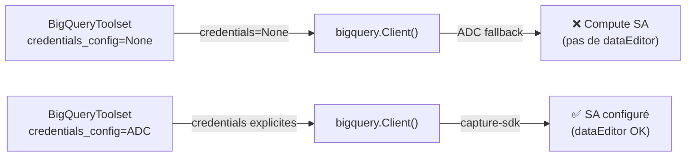

# Agent Engine Deploy — Skill Reference

> Deploy, manage and operate ADK agents on Vertex AI Agent Engine.

---

## §1 — Qu'est-ce que Agent Engine ?

Vertex AI **Agent Engine** est un ensemble de services managés de Google Cloud pour déployer, scaler et gouverner des agents IA en production.

### 1.1 Les services

| Service | Description | Statut |
|---------|-------------|--------|
| **Runtime** | Infra managée, scaling auto, containers applicatifs | GA |
| **Sessions** | Stockage des interactions user/agent (contexte conversationnel) | GA |
| **Memory Bank** | Mémoire persistante inter-sessions pour personnalisation | GA |
| **Code Execution** | Sandbox isolé et sécurisé pour exécution de code | Preview |
| **Example Store** | Stockage et récupération dynamique de few-shot examples | Preview |
| **Quality & Evaluation** | Évaluation intégrée via Gen AI Evaluation service | Preview |
| **Observability** | Cloud Trace (OpenTelemetry), Cloud Monitoring, Cloud Logging | GA |
| **Governance** | Threat Detection (SCC), Agent Identity (IAM) | Preview |

### 1.2 Frameworks supportés

Agent Engine supporte : **ADK**, LangChain, LangGraph, LlamaIndex, AG2, CrewAI, Custom frameworks, et le protocole **Agent2Agent (A2A)**.

### 1.3 Sécurité Enterprise

| Feature | Description |
|---------|-------------|
| **VPC Service Controls** | Périmètre réseau, bloque accès internet public |
| **Private Service Connect** | Communication avec services privés dans un VPC utilisateur |
| **CMEK** | Chiffrement avec clés gérées par le client |
| **Data Residency (DRZ)** | Données au repos dans la région spécifiée |
| **HIPAA** | Conforme pour workloads de santé |
| **Access Transparency** | Logs des accès Google au contenu |

### 1.4 Pricing

Un **free tier** est disponible pour Agent Engine Runtime. Au-delà, facturation standard Vertex AI.

---

## §2 — Prérequis

### 2.1 APIs à activer

```bash
gcloud services enable aiplatform.googleapis.com
```

### 2.2 Authentification

```bash
gcloud auth login
gcloud auth application-default login
gcloud config set project <PROJECT_ID>
```

> [!CAUTION]
> **ADC ≠ gcloud auth.** `adk deploy agent_engine` utilise les **Application Default Credentials (ADC)**, pas l'identité `gcloud auth`. Si les deux comptes diffèrent, le déploiement échoue avec `403 PERMISSION_DENIED` même si le compte `gcloud` a `roles/owner`.
>
> Vérifier l'identité ADC :
> ```bash
> curl -s "https://www.googleapis.com/oauth2/v1/tokeninfo?access_token=$(gcloud auth application-default print-access-token)" | python3 -c "import sys,json; print(json.load(sys.stdin).get('email'))"
> ```
>
> Si l'email ne correspond pas, re-configurer ADC :
> ```bash
> gcloud auth application-default login --account=<EMAIL_WITH_PERMISSIONS>
> ```

### 2.3 Rôles IAM nécessaires

Le **Service Account** utilisé par l'agent doit avoir :

| Rôle | Pourquoi |
|------|----------|
| `roles/aiplatform.user` | Accès à Vertex AI et Agent Engine |
| `roles/serviceusage.serviceUsageConsumer` | Fix crash au démarrage |
| `roles/cloudtrace.agent` | Tracing en production |
| `roles/bigquery.dataViewer` + `roles/bigquery.jobUser` | Si l'agent utilise BigQuery |
| Accès **Lecteur** dans Google Analytics (Admin > Property) | Si l'agent utilise GA4 |

### 2.4 Permissions additionnelles pour le déploiement

L'utilisateur qui déploie a besoin de :
- `roles/aiplatform.admin` ou `roles/aiplatform.reasoningEngineAdmin`
- `roles/storage.objectAdmin` (pour le staging GCS)
- `roles/iam.serviceAccountUser` (pour agir en tant que le SA)

---

## §3 — Structure du projet ADK

```
my_agent/
├── __init__.py              # from . import agent
├── agent.py                 # get_root_agent() ou root_agent
├── requirements.txt         # google-adk>=1.22.1, etc.
├── .env                     # Variables locales (dev)
├── .agent_engine_config.json # Config de déploiement
├── .ae_ignore               # Fichiers à exclure du staging
└── instructions/
    └── root_agent.md        # Instructions externalisées
```

### 3.1 Le fichier `.agent_engine_config.json`

Ce fichier contrôle le déploiement vers Agent Engine :

```json
{
    "display_name": "Mon Agent ADK",
    "python_version": "3.11",
    "service_account": "my-sa@my-project.iam.gserviceaccount.com",
    "env_vars": {
        "ADK_ENABLE_PROGRESSIVE_SSE_STREAMING": "1",
        "GOOGLE_CLOUD_PROJECT": "my-project"
    }
}
```

> [!IMPORTANT]
> Les `env_vars` dans `.agent_engine_config.json` sont les SEULES variables d'environnement injectées au runtime Agent Engine. Les définir uniquement dans `.env` ou `agent.py` (via `os.environ`) ne suffit **PAS** toujours.

> [!WARNING]
> **Priorité `.env` > `.agent_engine_config.json` pour `env_vars`.** Si un fichier `.env` existe dans le dossier agent, le CLI ADK lit ses variables et **remplace** (override) les `env_vars` du `.agent_engine_config.json`. Les variables définies uniquement dans le JSON config seront perdues. Pour garantir la prise en compte, ajouter les variables aux **deux** fichiers, ou n'utiliser que `.env`.

### 3.3 Le fichier `.ae_ignore`

Le CLI ADK utilise `.ae_ignore` (et **PAS** `.gcloudignore`) pour exclure des fichiers lors du staging (`shutil.copytree`) vers Agent Engine. Le format est identique à `shutil.ignore_patterns()` — un pattern glob par ligne.

```
.adk
.venv
__pycache__
*.pyc
.DS_Store
sa-key.json
.env
.git
```

> [!CAUTION]
> Sans `.ae_ignore`, le dossier `.adk/` (sessions locales, souvent > 7 MB) est copié dans le package et fait **dépasser la limite de 8 MB**, causant `400 INVALID_ARGUMENT: Request payload size exceeds the limit`.

### 3.2 Le fichier `requirements.txt`

```
google-adk>=1.22.1
google-cloud-aiplatform[agent_engines,adk]
google-genai
# --- OTEL pour Telemetry (§9.1) — OBLIGATOIRE si telemetry activée ---
opentelemetry-api
opentelemetry-sdk
opentelemetry-exporter-otlp-proto-http       # Export traces OTLP → telemetry.googleapis.com
opentelemetry-exporter-gcp-logging            # Export logs → Cloud Logging
opentelemetry-instrumentation-google-genai    # Instrumentation GenAI (prompts/réponses)
# Ajouter ici les dépendances spécifiques
```

> [!CAUTION]
> **Packages OTEL critiques !** `AdkApp._default_instrumentor_builder()` importe
> `opentelemetry.exporter.otlp.proto.http.trace_exporter` (package `opentelemetry-exporter-otlp-proto-http`).
> Si ce package est absent ou remplacé par `opentelemetry-exporter-gcp-trace`, **l'import échoue silencieusement**
> et aucun span n'est jamais exporté — le tracing est mort sans aucune erreur visible.

> [!WARNING]
> Pinne les versions pour des builds reproductibles. Minimise le nombre de dépendances.

---

## §4 — Déploiement via ADK CLI

### 4.1 Commande de base (nouveau déploiement)

```bash
adk deploy agent_engine \
  --project=<PROJECT_ID> \
  --region=<REGION> \
  --display_name="Mon Agent" \
  <agent_directory>
```

### 4.2 Mise à jour d'un agent existant (⚠️ Important)

Pour mettre à jour un agent **en place** (sans changer le `RESOURCE_ID`) :

```bash
adk deploy agent_engine \
  --project=<PROJECT_ID> \
  --region=<REGION> \
  --agent_engine_id=<RESOURCE_ID> \
  --display_name="Mon Agent V2" \
  --otel_to_cloud \
  --adk_app=main \
  <agent_directory>
```

> [!IMPORTANT]
> Utiliser `--agent_engine_id` pour conserver le même `RESOURCE_ID`. C'est **critique** quand d'autres services (API, front-end) référencent cet ID.

**Paramètres CLI :**

| Paramètre | Description |
|-----------|-------------|
| `--project` | ID du projet GCP |
| `--region` | Région de déploiement (ex: `us-central1`) |
| `--display_name` | Nom d'affichage dans la console |
| `--adk_app` | Point d'entrée si différent du défaut (ex: `main`) |
| `--agent_engine_id` | ID de l'agent existant à mettre à jour (update in-place) |
| `--otel_to_cloud` | Active le pipeline OTEL intégré du runtime Agent Engine (recommandé depuis ADK 1.23.0) |
| `--trace_to_cloud` | ⚠️ Ancien flag, active `enable_tracing=True` dans l'app. Utiliser `--otel_to_cloud` à la place |
| `<agent_directory>` | Dossier contenant le package agent |

### 4.3 Sortie attendue

```
Creating AgentEngine
Create AgentEngine backing LRO:
  projects/123456789/locations/us-central1/reasoningEngines/751619551677906944/operations/2356952072064073728
View progress and logs at https://console.cloud.google.com/logs/query?project=my-project
AgentEngine created. Resource name:
  projects/123456789/locations/us-central1/reasoningEngines/751619551677906944
To use this AgentEngine in another session:
  agent_engine = vertexai.agent_engines.get('projects/123456789/locations/us-central1/reasoningEngines/751619551677906944')
```

> **Conserver le `RESOURCE_ID`** (ex: `751619551677906944`) — il est nécessaire pour query, update, et delete.

### 4.3 Temps de déploiement

Le déploiement prend **plusieurs minutes** (packaging code → upload GCS → build container → démarrage HTTP server). La durée dépend du nombre de packages à installer.

---

## §5 — Déploiement via SDK Python

### 5.1 Depuis un objet agent (interactif, Colab)

```python
from google.cloud.aiplatform import vertexai

client = vertexai.Client(project="my-project", location="us-central1")

remote_agent = client.agent_engines.create(
    agent=local_agent,
    config={
        "requirements": ["google-adk>=1.22.1"],
        "display_name": "Mon Agent",
        "env_vars": {"ADK_ENABLE_PROGRESSIVE_SSE_STREAMING": "1"},
        "service_account": "my-sa@my-project.iam.gserviceaccount.com",
    },
)
```

**Processus interne :**
1. Génération locale d'un bundle : `*.pkl` (pickle de l'agent), `requirements.txt`, `dependencies.tar.gz`
2. Upload vers Cloud Storage
3. Agent Engine reçoit, build le container, démarre les serveurs HTTP

### 5.2 Depuis des fichiers sources (CI/CD, Terraform)

```python
remote_agent = client.agent_engines.create(
    config={
        "source_packages": ["agent_directory"],
        "entrypoint_module": "agent_directory.agent",
        "entrypoint_object": "root_agent",
        "requirements_file": "requirements.txt",
        "class_methods": [
            {
                "name": "stream_query",
                "api_mode": "async_stream",
                "parameters": {
                    "type": "object",
                    "properties": {
                        "message": {"type": "string"},
                        "session_id": {"type": "string"},
                    },
                    "required": ["message"],
                },
            },
        ],
        "display_name": "Mon Agent",
        "env_vars": {"ADK_ENABLE_PROGRESSIVE_SSE_STREAMING": "1"},
        "service_account": "my-sa@my-project.iam.gserviceaccount.com",
    },
)
```

**Paramètres `source_packages` :**
- `source_packages` (Required, `list[str]`) — Chemins locaux des fichiers/dossiers. Total < **8 MB**.
- `entrypoint_module` (Required) — Module Python qualifié (ex: `agent_directory.agent`)
- `entrypoint_object` (Required) — Objet callable dans le module (ex: `root_agent`)
- `class_methods` (Required) — Méthodes exposées. `api_mode` : `""`, `"async"`, `"stream"`, `"async_stream"`, `"bidi_stream"`

### 5.3 Paramètres de configuration complets

| Paramètre | Type | Description |
|-----------|------|-------------|
| `requirements` | `list[str]` | Packages pip à installer |
| `requirements_file` | `str` | Chemin vers `requirements.txt` dans `source_packages` |
| `extra_packages` | `list[str]` | Packages locaux additionnels |
| `display_name` | `str` | Nom d'affichage |
| `description` | `str` | Description de l'agent |
| `labels` | `dict` | Labels GCP |
| `env_vars` | `dict` | Variables d'environnement runtime |
| `service_account` | `str` | Service Account pour l'agent |
| `identity_type` | `str` | Type d'identité |
| `min_instances` | `int` | Instances minimum (0 = scale to zero) |
| `max_instances` | `int` | Instances maximum |
| `resource_limits` | `dict` | Limites CPU/Mémoire par container |
| `container_concurrency` | `int` | Concurrence par container (défaut: **9**, recommandé: **2×CPU+1**) |
| `build_options` | `dict` | Options de build (scripts d'installation custom) |
| `encryption_spec` | `dict` | Clé CMEK |
| `agent_framework` | `str` | Framework utilisé (ex: `"adk"`) |

---

## §6 — Architecture "Split Brain" (⚠️ Spécifique Projet)

### 6.1 Problème

Gemini 3.x Preview n'est disponible qu'en endpoint `global`, mais l'infrastructure Agent Engine nécessite une région spécifique (ex: `us-central1`). Déployer les deux dans la même région cause une erreur `400 ClientError: Region Mismatch`.

### 6.2 Solution : wrapper `GeminiGlobal`

> **📘 Voir le skill `adk-creation` §4.1** pour le code complet du wrapper `GeminiGlobal`.

Le principe : surcharger `api_client` pour forcer `location="global"` uniquement pour le LLM, tandis que l'infrastructure (Agent Engine, BigQuery) reste en `us-central1`.

### 6.3 Architecture

```
┌─────────────────────────────────────┐
│           Agent Engine              │
│         (us-central1)               │
│                                     │
│   ┌─────────────────────────┐       │
│   │   ADK Agent Runtime     │       │
│   │                         │       │
│   │   GeminiGlobal ──────────────▶ Gemini API (global)
│   │   BigQuery ──────────────────▶ BigQuery (us)
│   │   MCP GA4 ───────────────────▶ Cloud Run (europe-west1)
│   └─────────────────────────┘       │
└─────────────────────────────────────┘
```

### 6.4 Configuration du Thinking par modèle

> [!IMPORTANT]
> Source : [Gemini avec réflexion](https://ai.google.dev/gemini-api/docs/thinking?hl=fr) — Doc officielle Google, février 2026.

#### `thinkingLevel` — Gemini 3 (Flash / Pro)

| Niveau | Gemini 3 **Flash** | Gemini 3 **Pro** |
|---|---|---|
| `minimal` | ✅ (peut quand même réfléchir) | ❌ |
| `low` | ✅ | ❌ |
| `medium` | ✅ | ❌ |
| `high` | ✅ (défaut) | ✅ (seul supporté, défaut) |
| Non spécifié | Dynamique = `high` | Dynamique = `high` |
| Désactivation thinking | ❌ Impossible | ❌ Impossible |

> [!CAUTION]
> **Gemini 3 Pro ne supporte PAS le paramètre `thinkingLevel`.**
> Passer `thinking_level="medium"` provoque une erreur `400 INVALID_ARGUMENT`.
> Pour Pro, ne pas spécifier de `thinking_level` ou utiliser uniquement `include_thoughts=False`.

#### Exemples ADK

```python
# ✅ Flash avec thinking level medium
planner=BuiltInPlanner(
    thinking_config=types.ThinkingConfig(
        include_thoughts=False,
        thinking_level="medium",  # ✅ Flash only
    )
)

# ✅ Pro — PAS de thinking_level
planner=BuiltInPlanner(
    thinking_config=types.ThinkingConfig(
        include_thoughts=False,
        # ⚠️ NE PAS mettre thinking_level sur Pro !
    )
)
```

#### `thinkingBudget` — Gemini 2.5 (Flash / Pro)

Les modèles 2.5 n'utilisent PAS `thinkingLevel` mais `thinkingBudget` (nombre de tokens).

| Paramètre | Effet |
|---|---|
| `thinking_budget=0` | Désactive la réflexion |
| `thinking_budget=-1` | Réflexion dynamique (ajustée à la complexité) |
| `thinking_budget=1024` | Budget fixe de 1024 tokens pour la réflexion |
| Range | Min `128` — Max `32768` |

#### Signatures de pensée (Gemini 3)

Les modèles Gemini 3 renvoient des **signatures de pensée** (représentations chiffrées du processus de réflexion). Le SDK GenAI les gère automatiquement dans les interactions multi-tour. Points critiques :
- Ne pas concaténer les parties avec signature
- Ne pas fusionner une partie signée avec une non-signée
- Toujours renvoyer l'intégralité de la réponse avec toutes les signatures

---

## §7 — Interagir avec l'agent déployé

### 7.1 URL de requête

```
https://<LOCATION>-aiplatform.googleapis.com/v1/projects/<PROJECT_ID>/locations/<LOCATION>/reasoningEngines/<RESOURCE_ID>:query
```

### 7.2 Via SDK Python

```python
import vertexai

# Récupérer un agent déjà déployé
agent_engine = vertexai.agent_engines.get(
    "projects/123456789/locations/us-central1/reasoningEngines/751619551677906944"
)

# Lister les opérations supportées
agent_engine.operation_schemas()

# Récupérer le resource name
agent_engine.api_resource.name
```

### 7.3 Via REST API

```bash
# Query l'agent
curl -X POST \
  "https://us-central1-aiplatform.googleapis.com/v1/projects/my-project/locations/us-central1/reasoningEngines/RESOURCE_ID:query" \
  -H "Authorization: Bearer $(gcloud auth print-access-token)" \
  -H "Content-Type: application/json" \
  -d '{"input": {"messages": [{"role": "user", "parts": [{"text": "Hello"}]}]}}'
```

---

## §8 — Gestion du cycle de vie

### 8.1 Lister les agents déployés

```python
agents = client.agent_engines.list()
for a in agents:
    print(a.api_resource.name, a.api_resource.display_name)
```

**Console :** Agent Engine UI → `https://console.cloud.google.com/vertex-ai/agents/agent-engines`

### 8.2 Récupérer un agent

```python
agent = client.agent_engines.get("projects/PROJECT/locations/LOCATION/reasoningEngines/RESOURCE_ID")
```

### 8.3 Mettre à jour un agent

```python
agent = client.agent_engines.update(
    agent_engine="projects/PROJECT/locations/LOCATION/reasoningEngines/RESOURCE_ID",
    config={
        "display_name": "Agent V2",
        "env_vars": {"NEW_VAR": "value"},
    },
)
```

> [!NOTE]
> La mise à jour peut prendre quelques secondes à quelques minutes selon les champs modifiés.

### 8.4 Supprimer un agent

```python
client.agent_engines.delete(
    agent_engine="projects/PROJECT/locations/LOCATION/reasoningEngines/RESOURCE_ID"
)
```

> [!CAUTION]
> La suppression est irréversible. L'agent et sa configuration sont définitivement supprimés.

---

## §9 — Observabilité et Monitoring

### 9.1 Telemetry — Activation OBLIGATOIRE

La telemetry repose sur **3 piliers** : variables d'env, packages OTEL dans `requirements.txt`, et permissions IAM.

#### 9.1.1 Variables d'environnement

> [!IMPORTANT]
> Les variables de telemetry DOIVENT être dans `.agent_engine_config.json` sous `env_vars`.
> Les mettre dans `.env` ne suffit **PAS** si `.env` est dans `.ae_ignore` (ce qui est recommandé).

| Variable | Valeur | Effet |
|---|---|---|
| `GOOGLE_CLOUD_AGENT_ENGINE_ENABLE_TELEMETRY` | `"true"` | Dashboard Observability + traces OpenTelemetry + logs Cloud Logging |
| `OTEL_INSTRUMENTATION_GENAI_CAPTURE_MESSAGE_CONTENT` | `"SPAN_AND_EVENT"` | Capture prompts/réponses dans spans ET events (⚠️ PII/RGPD) |
| `OTEL_INSTRUMENTATION_GENAI_CAPTURE_MESSAGE_CONTENT_MAX_LENGTH` | `"0"` | Pas de troncature (0 = illimité) |
| `OTEL_GEMINI_INSTRUMENTATION_GENAI_UPLOAD_CONTENT_FORMAT` | `"JSONL"` | Format d'upload vers GCS |
| `OTEL_GEMINI_INSTRUMENTATION_GENAI_CONTENT_UPLOAD_HOOK` | `"gcs"` | Upload prompts/réponses vers GCS |
| `OTEL_GEMINI_INSTRUMENTATION_GENAI_CONTENT_UPLOAD_GCS_PATH` | `"gs://BUCKET/otel-data"` | Chemin GCS pour upload |
| `OTEL_SEMCONV_STABILITY_OPT_IN` | `"http"` | Active les conventions sémantiques HTTP stables |

> [!CAUTION]
> **`CAPTURE_MESSAGE_CONTENT` accepte des enums, PAS `"true"`!**
> Le package `opentelemetry-instrumentation-google-genai` attend une valeur de l'enum
> `CaptureContentConfig` : `"NO_CONTENT"`, `"SPAN_ONLY"`, `"EVENT_ONLY"`, `"SPAN_AND_EVENT"`.
> La valeur `"true"` est **silencieusement ignorée** et traité comme `NO_CONTENT`.

> [!CAUTION]
> **Limite 64K par attribut Cloud Trace !** Avec `SPAN_AND_EVENT`, le texte complet
> des prompts/réponses est dans les attributs de span. Pour un système multi-agents
> les attributs dépassent facilement 64K. Cloud Trace rejette alors **TOUT le batch**
> avec `400: Span.Attributes[5].value is too large; at most 64.0K is allowed`.
> **Recommandation :** Utiliser l'upload GCS (voir variables ci-dessus) en complément.

```json
{
    "env_vars": {
        "GOOGLE_CLOUD_AGENT_ENGINE_ENABLE_TELEMETRY": "true",
        "OTEL_INSTRUMENTATION_GENAI_CAPTURE_MESSAGE_CONTENT": "SPAN_AND_EVENT",
        "OTEL_INSTRUMENTATION_GENAI_CAPTURE_MESSAGE_CONTENT_MAX_LENGTH": "0",
        "OTEL_GEMINI_INSTRUMENTATION_GENAI_UPLOAD_CONTENT_FORMAT": "JSONL",
        "OTEL_GEMINI_INSTRUMENTATION_GENAI_CONTENT_UPLOAD_HOOK": "gcs",
        "OTEL_GEMINI_INSTRUMENTATION_GENAI_CONTENT_UPLOAD_GCS_PATH": "gs://ia-initiatives-agent-traces/otel-data",
        "OTEL_SEMCONV_STABILITY_OPT_IN": "http"
    }
}
```

> [!WARNING]
> **Sync `.env` ↔ `.agent_engine_config.json` OBLIGATOIRE !** Le CLI ADK **override** les
> `env_vars` du config JSON avec celles du `.env` lors du deploy. Si une clé est dans le JSON
> mais PAS dans `.env`, elle est **supprimée** du déploiement final. Synchroniser les deux fichiers.

#### 9.1.2 Packages OTEL dans `requirements.txt` — CRITIQUE

> [!CAUTION]
> **C'est la cause #1 de "traces vides sans erreur" !** `AdkApp._default_instrumentor_builder()`
> importe des packages spécifiques. Si un import échoue, la fonction retourne `None` **silencieusement**
> et aucun span n'est jamais exporté.

**Packages OBLIGATOIRES :**

| Package | Utilisé par | Si absent |
|---|---|---|
| `opentelemetry-api` | API de base | Crash au démarrage |
| `opentelemetry-sdk` | TracerProvider, BatchSpanProcessor | Crash au démarrage |
| `opentelemetry-exporter-otlp-proto-http` | Export OTLP → `telemetry.googleapis.com` | ⚠️ **Echec silencieux** — 0 traces |
| `opentelemetry-exporter-gcp-logging` | Export logs → Cloud Logging | ⚠️ Echec silencieux — 0 logs |
| `opentelemetry-instrumentation-google-genai>=0.4b0` | Instrumentation GenAI + upload GCS | Warning mais pas bloquant |
| `fsspec[gcs]` | Backend GCS pour upload JSONL | Upload GCS échoue silencieusement |

**⚠️ ERREUR COURANTE :** Ne PAS utiliser `opentelemetry-exporter-gcp-trace` à la place de
`opentelemetry-exporter-otlp-proto-http`. Ce sont deux packages différents !
L'AdkApp utilise l'exporteur OTLP HTTP, pas l'exporteur GCP natif.

#### 9.1.3 `--otel_to_cloud` vs `--trace_to_cloud`

Depuis **ADK 1.23.0**, utiliser **`--otel_to_cloud`** (pas `--trace_to_cloud`) :

| Flag CLI | Mécanisme | Recommandation |
|---|---|---|
| `--otel_to_cloud` | Set `GOOGLE_CLOUD_AGENT_ENGINE_ENABLE_TELEMETRY=true` → active le collector OTEL intégré du runtime | **✅ Recommandé** |
| `--trace_to_cloud` | Set `enable_tracing=True` dans `AdkApp()` → utilise les exporters SDK internes | ⚠️ Ancien mécanisme, peut entrer en conflit |

> [!CAUTION]
> **Ne PAS utiliser les deux flags ensemble.** Cela crée un conflit entre deux pipelines d'export.
> Le runtime Agent Engine attend les traces de son propre collector OTEL, pas de l'SDK interne.

#### 9.1.4 Prérequis GCP

| Prérequis | Commande de vérification |
|---|---|
| API `telemetry.googleapis.com` | `gcloud services list --enabled --filter="name:telemetry"` |
| API `cloudtrace.googleapis.com` | `gcloud services list --enabled --filter="name:cloudtrace"` |
| API `logging.googleapis.com` | `gcloud services list --enabled --filter="name:logging"` |
| Rôle `roles/cloudtrace.agent` sur le SA | `gcloud projects get-iam-policy <PROJECT> --filter="bindings.members:<SA>"` |

#### 9.1.5 Console Observability

Le panneau "Service configuration > Observability" dans la console Agent Engine est **informatif uniquement**.
Il n'y a PAS de toggle à activer côté console. Il affiche simplement les instructions pour configurer
les variables d'environnement et re-déployer.

**CLI :** Le flag `--otel_to_cloud` sur `adk deploy agent_engine` active le pipeline du runtime.

### 9.4 Container configuration

| Paramètre | Recommandation |
|-----------|----------------|
| **Container Concurrency** | Défaut: **9**. Recommandé: **2 × CPU + 1** |
| **Min instances** | 0 (scale to zero) ou 1 (warm start) |
| **Max instances** | Selon le trafic attendu |
| **CPU/Memory limits** | Configurable dans la console |

---

## §10 — Troubleshooting

### 10.1 Erreur `400 INVALID_ARGUMENT: payload > 8 MB`

**Cause :** Le dossier `.adk/` (sessions locales) ou `.venv/` est copié dans le staging, dépassant la limite de 8 MB.

**Fix :** Créer un fichier `.ae_ignore` dans le dossier agent (voir §3.3). Le CLI ADK utilise `.ae_ignore` et **ignore** `.gcloudignore`.

### 10.2 Erreur `400 INVALID_ARGUMENT` (appels de fonctions parallèles)

**Cause :** Bug connu avec Gemini 3.0+ et les appels de fonctions parallèles.

**Fix :**
1. Version ADK >= `1.22.1` dans `requirements.txt`
2. Variable `ADK_ENABLE_PROGRESSIVE_SSE_STREAMING="1"` dans `.agent_engine_config.json` sous `env_vars`

> GitHub Issue: [google/adk-python#3705](https://github.com/google/adk-python/issues/3705)

### 10.3 Erreur `403 PERMISSION_DENIED` sur `reasoningEngines.update`

**Cause :** L'identité **ADC** (Application Default Credentials) n'a pas les permissions, même si le compte `gcloud auth` les a. Ce sont deux identités distinctes.

**Fix :**
1. Vérifier l'identité ADC (voir §2.2)
2. Si l'email ne correspond pas : `gcloud auth application-default login --account=<EMAIL>`
3. Confirmer que ce compte a `roles/aiplatform.admin` sur le projet

### 10.4 Erreur `Region Mismatch` (400 ClientError)

**Cause :** Le modèle Gemini 3.x n'existe pas dans la région de l'infra.

**Fix :** Utiliser le wrapper `GeminiGlobal` (voir §6).

### 10.5 Crash au démarrage du service

**Cause :** Le Service Account n'a pas le rôle `serviceusage.serviceUsageConsumer`.

**Fix :**
```bash
gcloud projects add-iam-policy-binding <PROJECT_ID> \
  --member="serviceAccount:<SA_EMAIL>" \
  --role="roles/serviceusage.serviceUsageConsumer"
```

### 10.6 Variables d'environnement non prises en compte

**Cause :** Les variables définies uniquement dans `.env` ou `os.environ` dans `agent.py` ne sont pas injectées dans le runtime Agent Engine.

**Fix :** Les déclarer dans `.agent_engine_config.json` sous `env_vars`. Attention : `.env` **override** les `env_vars` du config JSON (voir §3.1).

### 10.7 Erreur de permissions BigQuery/GA4

**Cause :** Le Service Account de l'agent n'a pas les rôles nécessaires.

**Fix :** Voir §2.3 pour les rôles IAM requis.

### 10.11 ⚠️ BigQuery `403 Access Denied` en écriture (INSERT/UPDATE/DELETE)

**Statut :** Résolu — pattern validé en production (16/02/2026)

**Symptôme :** L'agent peut faire des `SELECT` mais les `INSERT` dans un projet BigQuery externe échouent avec `403 Access Denied: User does not have bigquery.tables.updateData permission`.

**Root cause :** Quand `BigQueryToolset(credentials_config=None)`, le `GoogleTool` interne passe `credentials=None` au `bigquery.Client()`. Celui-ci fait sa propre résolution ADC, qui dans l'environnement Agent Engine peut résoudre vers le **Compute Engine SA par défaut** (`PROJECT_NUMBER-compute@developer.gserviceaccount.com`) au lieu du SA configuré dans `.agent_engine_config.json`.



**Fix :** Passer les credentials ADC **explicitement** via `BigQueryCredentialsConfig` :

```python
import google.auth
from google.adk.tools.bigquery.bigquery_toolset import BigQueryToolset, BigQueryToolConfig
from google.adk.tools.bigquery.bigquery_credentials import BigQueryCredentialsConfig

# Récupérer les credentials ADC (= le SA configuré dans Agent Engine)
_credentials, _project = google.auth.default(
    scopes=["https://www.googleapis.com/auth/bigquery"],
)

bq_toolset = BigQueryToolset(
    credentials_config=BigQueryCredentialsConfig(
        credentials=_credentials,
    ),
    bigquery_tool_config=BigQueryToolConfig(
        location="EU",
        write_mode="allowed",
        compute_project_id="ia-initiatives",  # Projet de facturation des jobs
    ),
)
```

> [!CAUTION]
> **Ne PAS utiliser l'impersonation SA (`google.auth.impersonated_credentials`)** si le runtime Agent Engine tourne DÉJÀ en tant que le SA cible. L'auto-impersonation échoue avec `iam.serviceAccounts.getAccessToken denied`.

### 10.8 Déploiement trop long ou timeout

**Cause probable :** Trop de dépendances dans `requirements.txt`.

**Fix :** Minimiser les dépendances. Vérifier que `source_packages` < 8 MB.

### 10.9 ⚠️ CONNU — Onglet Traces vide / `invalid_scope` sur OTLP export

**Statut :** Bug ADK connu — **non résolu** (ADK ≤1.25.0, 13 février 2026)

**Root cause :** `_get_gcp_span_exporter()` dans `google/adk/telemetry/google_cloud.py` appelle
`AuthorizedSession(credentials=credentials)` SANS ajouter les OAuth scopes. Quand les credentials
sont de type SA (cas Agent Engine runtime), `_make_authorization_grant_assertion()` produit un JWT
avec un scope vide → rejeté par Google OAuth endpoint → `invalid_scope`.

```python
# Bug dans ADK google_cloud.py (identique dans main branch)
def _get_gcp_span_exporter(credentials):
    return BatchSpanProcessor(
        OTLPSpanExporter(
            session=AuthorizedSession(credentials=credentials),  # ← PAS DE SCOPES !
            endpoint='https://telemetry.googleapis.com/v1/traces',
        )
    )
# Fix attendu : credentials = credentials.with_scopes(["https://www.googleapis.com/auth/cloud-platform"])
```

**Impact :** L'export des trace spans vers Cloud Trace NE FONCTIONNE PAS. L'onglet Traces est vide.

**Ce qui FONCTIONNE malgré le bug :**
- ✅ **Upload GCS des prompts/réponses** via `opentelemetry-instrumentation-google-genai`
- ✅ **Cloud Logging** (stdout/stderr) — tous les logs de l'agent sont visibles
- ✅ **Dashboard Observability** (Models, Tools, overview)

**Workaround :** Utiliser Cloud Logging + GCS upload pour le debug. Les prompts, réponses, et
appels de fonctions sont tous visibles dans les logs et dans le bucket GCS.

### 10.10 Upload GCS — Prérequis

L'upload des prompts/réponses vers GCS (via `opentelemetry-instrumentation-google-genai`) nécessite :

| Prérequis | Détail |
|---|---|
| Bucket GCS créé | `gsutil mb gs://BUCKET_NAME` |
| SA a `roles/storage.objectCreator` sur le bucket | `gsutil iam ch serviceAccount:SA:objectCreator gs://BUCKET` |
| `fsspec[gcs]` dans `requirements.txt` | Backend GCS pour l'upload |
| Variables d'env configurées (§9.1.1) | `CONTENT_UPLOAD_HOOK=gcs`, `CONTENT_UPLOAD_GCS_PATH=gs://...` |

---

## §11 — Fichier `.agent_engine_config.json` de référence (Projet)

```json
{
    "display_name": "ADK Analyst Agent V8 (GCS Traces)",
    "python_version": "3.11",
    "service_account": "capture-sdk@ia-initiatives.iam.gserviceaccount.com",
    "env_vars": {
        "ADK_ENABLE_PROGRESSIVE_SSE_STREAMING": "1",
        "GA_IMPERSONATE_EMAIL": "consulting@edgeangel.fr",
        "GOOGLE_CLOUD_PROJECT": "ia-initiatives",
        "GOOGLE_CLOUD_AGENT_ENGINE_ENABLE_TELEMETRY": "true",
        "OTEL_INSTRUMENTATION_GENAI_CAPTURE_MESSAGE_CONTENT": "SPAN_AND_EVENT",
        "OTEL_INSTRUMENTATION_GENAI_CAPTURE_MESSAGE_CONTENT_MAX_LENGTH": "0",
        "OTEL_GEMINI_INSTRUMENTATION_GENAI_UPLOAD_CONTENT_FORMAT": "JSONL",
        "OTEL_GEMINI_INSTRUMENTATION_GENAI_CONTENT_UPLOAD_HOOK": "gcs",
        "OTEL_GEMINI_INSTRUMENTATION_GENAI_CONTENT_UPLOAD_GCS_PATH": "gs://ia-initiatives-agent-traces/otel-data",
        "OTEL_SEMCONV_STABILITY_OPT_IN": "http"
    }
}
```

**Commande de déploiement validée (nouveau) :**

```bash
adk deploy agent_engine \
  --project=ia-initiatives \
  --region=us-central1 \
  --adk_app=main \
  capture_ia_analyst_flash
```

**Commande de mise à jour validée (update in-place) :**

```bash
adk deploy agent_engine \
  --project=ia-initiatives \
  --region=us-central1 \
  --agent_engine_id=1584190646950821888 \
  --display_name="ADK Analyst Agent V5 (Piano)" \
  --otel_to_cloud \
  --adk_app=main \
  capture_ia_analyst_flash
```

**Ressources déployées existantes :**

| Agent | Date | Resource ID |
|-------|------|-------------|
| **Flash V13 (Direct ADC)** | **16/02/2026** | **`1584190646950821888`** |
| **High V13 (Direct ADC)** | **16/02/2026** | **`5956622935174152192`** |
| Capture IA Analyst Flash | 15/01/2026 | `3648985522983927808` |
| Capture IA Analyst High | 15/01/2026 | `2716177450164813824` |
| V3 (Remote MCP) | 08/01/2026 | `4438030251448074240` |

---

## §12 — Régions supportées

Voir l'[inventaire officiel](https://cloud.google.com/agent-builder/locations#supported-regions-agent-engine).

Régions couramment utilisées :
- `us-central1` (défaut du projet)
- `europe-west1`, `europe-west4`
- `asia-northeast1`

---

## §13 — Migration SDK

Le module `agent_engines` du Vertex AI SDK est en cours de migration vers un design **client-based** pour :
- Alignement avec Google ADK et Google Gen AI SDK
- Scoping par projet/location au niveau client
- Meilleure découvrabilité des services

**Version SDK minimale :** `google-cloud-aiplatform >= 1.112.0`

> Voir le [guide de migration](https://cloud.google.com/agent-builder/deprecations/agent-engine-migration).

---

## §14 — Checklist de déploiement

```
PRÉ-DÉPLOIEMENT
[ ] API Vertex AI activée sur le projet
[ ] Service Account créé avec les rôles IAM (§2.3)
[ ] ADC configuré avec le bon compte (§2.2) — PAS juste gcloud auth !
[ ] .agent_engine_config.json configuré (display_name, SA, env_vars)
[ ] .ae_ignore créé pour exclure .adk, .venv (§3.3)
    [ ] ⚠️ NE PAS exclure sa-key.json si DWD impersonation GA4 nécessaire
[ ] requirements.txt avec versions pinnées
    [ ] google-adk >= 1.22.1
    [ ] Packages OTEL OBLIGATOIRES (§9.1.2) :
        [ ] opentelemetry-api
        [ ] opentelemetry-sdk
        [ ] opentelemetry-exporter-otlp-proto-http (PAS gcp-trace !)
        [ ] opentelemetry-exporter-gcp-logging
        [ ] opentelemetry-instrumentation-google-genai
[ ] .env synchronisé avec .agent_engine_config.json env_vars (§9.1.2)
[ ] ADK_ENABLE_PROGRESSIVE_SSE_STREAMING dans env_vars
[ ] GeminiGlobal wrapper si modèle preview (§6)
[ ] Test local réussi (adk web / adk run)

DÉPLOIEMENT
[ ] adk deploy agent_engine --project --region --otel_to_cloud --adk_app <dir>
[ ] --agent_engine_id si update d'un agent existant
[ ] RESOURCE_ID noté et documenté
[ ] Vérification dans la console Vertex AI

POST-DÉPLOIEMENT
[ ] Test via REST API ou SDK
[ ] Observabilité activée — vérifier :
    [ ] GOOGLE_CLOUD_AGENT_ENGINE_ENABLE_TELEMETRY=true dans env_vars
    [ ] OTEL_INSTRUMENTATION_GENAI_CAPTURE_MESSAGE_CONTENT=true dans env_vars
    [ ] Dashboard Observability visible (Overview, Models, Tools, Logs)
    [ ] Onglet Traces affiche des spans après un test
    [ ] SA a roles/cloudtrace.agent
    [ ] APIs telemetry + cloudtrace + logging activées
[ ] Permissions additionnelles si nécessaire (BQ, GA4, etc.)
[ ] BigQuery écriture cross-projet : credentials explicites dans BigQueryToolset (§10.11)
```

---

## §15 — Liens de référence

| Ressource | URL |
|-----------|-----|
| **Agent Engine Overview** | https://cloud.google.com/vertex-ai/generative-ai/docs/agent-engine/overview |
| **Deploy an Agent** | https://cloud.google.com/vertex-ai/generative-ai/docs/agent-engine/deploy |
| **Manage Agents** | https://cloud.google.com/vertex-ai/generative-ai/docs/agent-engine/manage/overview |
| **ADK Deploy Docs** | https://google.github.io/adk-docs/deploy/agent-engine/deploy/ |
| **ADK CLI Reference** | https://google.github.io/adk-docs/api-reference/cli/cli.html#adk-deploy-agent-engine |
| **Agent Engine Pricing** | https://cloud.google.com/vertex-ai/pricing#vertex-ai-agent-engine |
| **Supported Regions** | https://cloud.google.com/agent-builder/locations#supported-regions-agent-engine |
| **SDK Migration Guide** | https://cloud.google.com/agent-builder/deprecations/agent-engine-migration |
| **Agent Starter Pack** | https://github.com/GoogleCloudPlatform/agent-starter-pack |
| **Console Agent Engine** | https://console.cloud.google.com/vertex-ai/agents/agent-engines |

> [!TIP]
> Pour explorer la documentation Vertex AI Agent Engine à jour :
> ```
> search_documents("Vertex AI Agent Engine deploy manage ADK agent")
> search_documents("Vertex AI Agent Engine telemetry observability Cloud Trace")
> search_documents("ADK agent configuration deployment Cloud Run")
> ```
